<div align="center">
  <h1>👋 Hi, I'm Priyansh Prajapat</h1>
  <b>I'm a passionate developer from India.</b>
</div>

<div align="center">
   
  ✨ Learn more about me on [oyepriyansh.github.io](https://oyepriyansh.github.io). <br>
  💻 Find more of my projects: [github.com/oyepriyansh/repositories](https://github.com/oyepriyansh?tab=repositories). <br>
  💌 You can reach me via email at [oyepriyansh@outlook.com](mailto:oyepriyansh@outlook.com).
</div>

<div align="center">
  <a href="#"></a>
  <details>
    <summary>See more</summary>
    <a href="#"></a> <br>
    <a href="#"></a>
    <details open>
      <summary>About me</summary>
      <div align="left">

```js
/**
 * Represents me.
 * @constructor
 * @param {string} languages - Hindi, Gujrati, English.
 * @param {string} hobbies - Cricket, Music, Gaming.
 * @param {string} interests - DiscordJS, Open Source, Javascript, Java.
 * @param {Date} birthday - 28th of May.
 */
```
  </div>
</details>

<details open>
  <summary>Activity Status</summary>
  <div>
    <a href="https://discord.com/users/838764339942785051" target="_blank">
      
    </a> <br>
    <a href="https://open.spotify.com/user/31avju6qooefrvmgopx3xm62m624" target="_blank">
      
    </a>
  </div>
</details>

<details open>
  <summary>Recent Activity</summary>

<!--RECENT_ACTIVITY:start-->
 [#242](https://github.com/oyepriyansh/DevProfiles/pull/242) **|** [oyepriyansh/DevProfiles](https://github.com/oyepriyansh/DevProfiles)<br>
 [#242](https://github.com/oyepriyansh/DevProfiles/pull/242#pullrequestreview-2067984509) **|** [oyepriyansh/DevProfiles](https://github.com/oyepriyansh/DevProfiles)<br>
 [#241](https://github.com/oyepriyansh/DevProfiles/issues/241) **|** [oyepriyansh/DevProfiles](https://github.com/oyepriyansh/DevProfiles)<br>
 [priyankarpal/ts-express-prisma-postgresql-boilerplate](https://github.com/priyankarpal/ts-express-prisma-postgresql-boilerplate)<br>
 [getify/You-Dont-Know-JS](https://github.com/getify/You-Dont-Know-JS)<br>
 [MFDGaming/ubuntu-in-termux](https://github.com/MFDGaming/ubuntu-in-termux)<br>
 [google/styleguide](https://github.com/google/styleguide)<br>
 [wdhdev/global-chat](https://github.com/wdhdev/global-chat)<br>
 [codecrafters-io/build-your-own-x](https://github.com/codecrafters-io/build-your-own-x)<br>
 [devarshishimpi/staticstorm](https://github.com/devarshishimpi/staticstorm)<br>
 [KillYoy/DiscordNight](https://github.com/KillYoy/DiscordNight)<br>
 [videojs/video.js](https://github.com/videojs/video.js)<br>
 [OpenDevin/OpenDevin](https://github.com/OpenDevin/OpenDevin)<br>
 [JuanPabloDiaz/freeForGeeks](https://github.com/JuanPabloDiaz/freeForGeeks)<br>
 [monkeytypegame/monkeytype](https://github.com/monkeytypegame/monkeytype)<br>
<!--RECENT_ACTIVITY:end-->

</details>

<details open>
  <summary>GitHub Stats</summary>

  <a href="#"></a><br>
  <a href="#"></a><br>
  <a href="#"></a><br>

</details>

</details>
  <a href="#"></a>
</div>
<div align="center">
  <a href="https://twitter.com/oyepriyansh" target="blank"></a>
  <a href="https://linkedin.com/in/oyepriyansh" target="blank"></a> 
  <a href="https://instagram.com/oyepriyansh" target="blank"></a>
  <a href="https://discord.com/invite/AeAjegXn6D" target="blank"></a>
</div>

