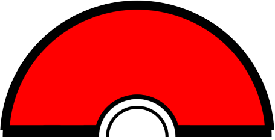

<div>

<div align="center">
<h1> 👋 Hi, I'm Priyansh Prajapat </h1>
I'm a passionate self-taught developer from India.

✨️ Learn more about me on my [portfolio](https://oyepriyansh.github.io). <br>
💻 Find more of my projects [here](https://github.com/oyepriyansh?tab=repositories). <br>
💌 You can reach me via email at [hi@oyepriyansh.dev](mailto:hi@oyepriyansh.dev). </p>
</div>

<div align="center">

<details>
<summary>View Profile</summary>
   
   

<details>
<summary>About me</summary>
<div align="left">

```js
/**
 * Represents me.
 * @constructor
 * @param {string} languagues - Hindi, Gujrati, English.
 * @param {string} hobbies - Anime, Music, Gaming.
 * @param {string} interests - AI, Open Source, Javascript, Python.
 * @param {Date} birthday - 28th of May.
 */
```
</div>
</details>

<details>
<summary>Status</summary>
<div>
    <br>
<a href="https://discord.com/users/838764339942785051" target="_blank">  </a></div>
</details>

</details>

</div>

<div align="center">
<a href="https://x.com/oyepriyansh" target="blank"></a><a href="https://linkedin.com/in/oyepriyansh" target="blank"></a> &ensp;
<a href="https://instagram.com/oyepriyansh" target="blank"></a> &ensp;
<a href="https://discord.gg/AeAjegXn6D" target="blank"></a> &ensp;
</div>

</div>